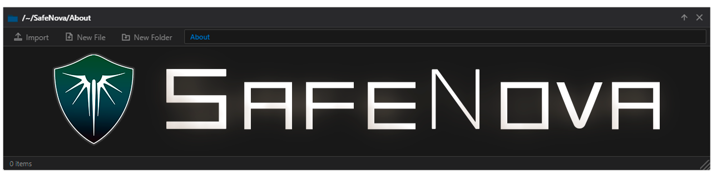
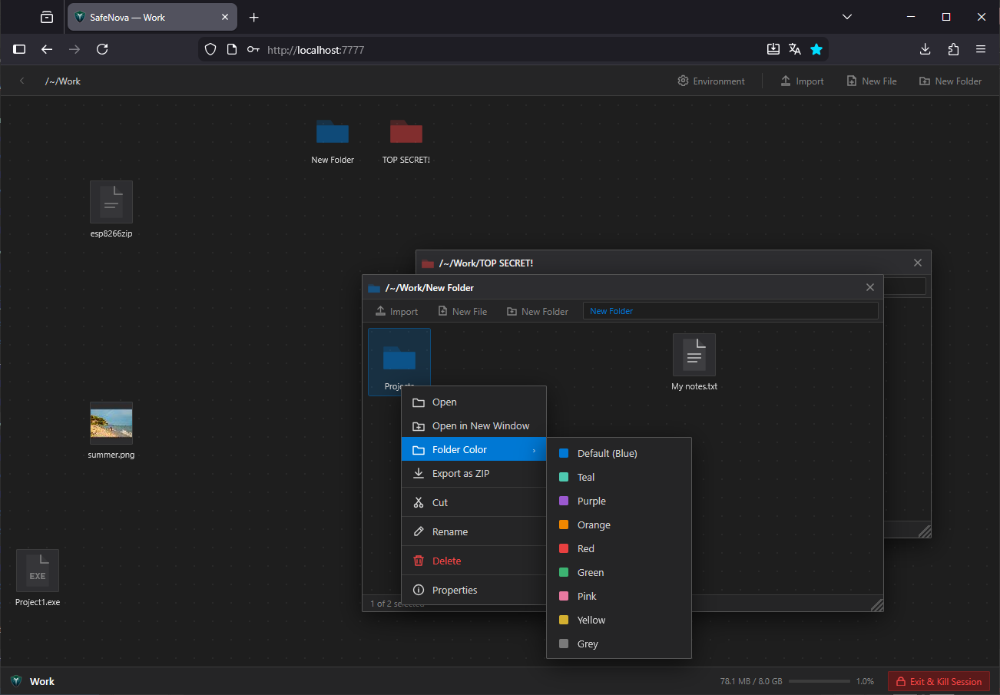
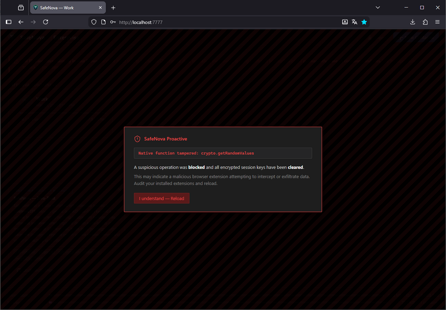
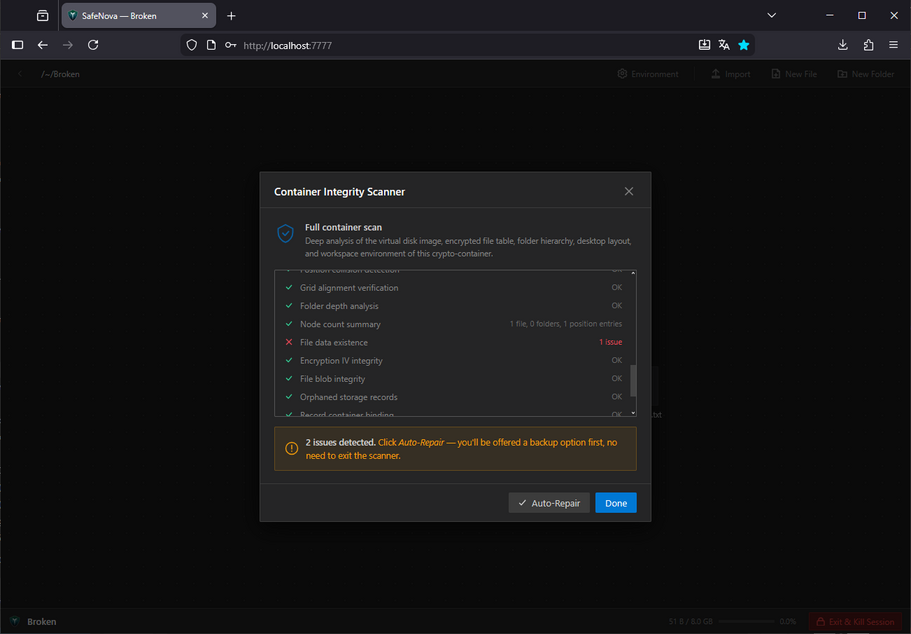

> ### Try it online: [https://safenova.dosx.su/](https://safenova.dosx.su/)

<a id="what-it-is"></a>

## ❔ What it is

SafeNova is a single-page web app that lets you create encrypted **containers** — isolated vaults where you can organize files in a folder structure, much like a regular desktop file manager. Everything is encrypted client-side before being written to storage. Nothing ever leaves your device.



Key properties:

-   **Zero-knowledge** — the app never sees your password or plaintext data
-   **Offline-first** — works entirely without network access
-   **No installation** — start the local server and you're running (or use online)

---

## 📚 Table of Contents

-   [❔ What it is](#what-it-is)
-   [🚀 Getting started](#getting-started)
    -   [Option A — Use online version](#getting-started-online)
    -   [Option B — Local server](#getting-started-local)
-   [📋 Requirements](#requirements)
-   [⚙️ Features](#features)
-   [⚔️ SafeNova vs. the Competition](#comparison)
-   [📁 Project structure](#project-structure)
-   [🔒 How containers work](#how-containers-work)
-   [📄 The `.safenova` Container Format](#container-format)
    -   [Archive sections](#container-format-archive-sections)
    -   [Design properties](#container-format-design-properties)
-   [🔐 Encryption](#encryption)
    -   [Session token security](#session-token-security)
    -   [Current tab session](#current-tab-session)
    -   [Stay signed in](#stay-signed-in)
    -   [Three-source key wrapping](#three-source-key-wrapping)
    -   [Session payload format](#session-payload-format)
    -   [Remaining trade-off](#remaining-trade-off)
-   [🔏 Content Security Policy](#content-security-policy)
    -   [Meta tag](#csp-meta-tag)
    -   [Server-level headers](#csp-server-headers)
-   [🛡️ Cross-Tab Session Protection](#cross-tab-session-protection)
-   [🛑 Duress Password](#duress-password)
    -   [How it works](#duress-how-it-works)
    -   [Why this design](#duress-why-this-design)
    -   [Technical details](#duress-technical-details)
-   [🔬 SafeNova Proactive Anti-Tamper](#safenova-proactive-antitamper)
    -   [Startup sequence](#proactive-startup-sequence)
        -   [Why native restoration matters](#proactive-native-restoration-advantage)
    -   [Real-time watchdog](#proactive-watchdog)
    -   [Watchdog resilience](#proactive-watchdog-resilience)
    -   [Intentionally excluded from checks](#proactive-excluded-checks)
    -   [Network request interception](#proactive-network-interception)
    -   [DOM exfiltration defense](#proactive-dom-exfiltration)
    -   [Threat response](#proactive-threat-response)
    -   [Design philosophy](#proactive-design-philosophy)
        -   [Hook opacity](#proactive-hook-opacity)
-   [🔍 Container Integrity Scanner](#container-integrity-scanner)
    -   [Phase 1 — VFS structural checks](#scanner-phase-1)
    -   [Phase 2 — Database-level checks](#scanner-phase-2)
-   [⚡ Performance](#performance)
    -   [Adaptive concurrency](#adaptive-concurrency)
    -   [Bulk upload](#bulk-upload)
    -   [ZIP export](#zip-export)
    -   [Password change](#password-change)
    -   [Container export](#container-export)
    -   [Drag-and-drop performance](#drag-drop-performance)
-   [📱 Mobile Touch Support](#mobile-touch-support)
    -   [Long-press to drag](#mobile-long-press)
    -   [Multi-file drag](#mobile-multi-file-drag)
    -   [Context menu](#mobile-context-menu)
    -   [Paste at finger position](#mobile-paste-at-finger-position)
    -   [Overscroll](#mobile-overscroll)
-   [🛠️ Contribute](#contribute)
-   [💬 Community](#community)
-   [🤝 Thanks to all contributors](#thanks)

---

<a id="getting-started"></a>

## 🚀 Getting started

<a id="getting-started-online"></a>

### Option A — Use online version

SafeNova is hosted on: [https://safenova.dosx.su/](https://safenova.dosx.su/)

<a id="getting-started-local"></a>

### Option B — Local server

A zero-dependency PowerShell server is included:

```powershell
.\\.server.ps1
```

Or right-click the file → **Run with PowerShell**. It starts an HTTP server on port `7777` (or the next free port) and opens the app in your default browser.

No external installs needed — it uses the Windows built-in `HttpListener`.

---

<a id="requirements"></a>

## 📋 Requirements

-   A modern browser: **Chrome 90+**, **Firefox 90+**, **Safari 15+**, or **Edge 90+**
-   Web Crypto API must be available — this requires either **HTTPS** or **`localhost`**
-   No plugins, no extensions, no backend

---

<a id="features"></a>

## ⚙️ Features

-   **Multiple containers** — each with its own password and independent storage limit (8 GB per container)
-   **Virtual filesystem** — nested folders, drag-to-reorder icons, customizable folder colors
-   **File operations** — upload (drag & drop or browse; folder upload with 4× parallel encryption), download, copy, cut, paste, rename, delete
-   **Built-in viewers** — text editor, image viewer, audio/video player, PDF viewer
-   **Hardware key support** — optionally use a WebAuthn passkey to strengthen the container salt
-   **Session memory** — optionally remember your session per tab (ephemeral, recommended) or persistently until manually signed out, using AES-GCM-encrypted session tokens; persistent sessions survive browser restarts
-   **Cross-tab session protection** — a container can only be actively open in one browser tab at a time; a lightweight lock protocol detects conflicts and offers instant session takeover
-   **Container import / export** — portable `.safenova` container files; import reads the archive via streaming `File.slice()` without loading the full file into memory, making multi-gigabyte imports possible; export streams data chunk-by-chunk requiring no single contiguous allocation regardless of container size
-   **Export password guard** — configurable setting (on by default) to require password confirmation before exporting; when disabled, the container key is taken directly from the active session if one is open; if no session is present, a pre-generated encrypted export cache stored in IDB is used — the cache payload is deflate-compressed before encryption, reducing its IDB footprint significantly for containers with many files; the compressed bytes are then wrapped with a per-container HKDF-SHA-256 derived key (AES-256-GCM), making the cache browser-independent; if the cache is absent or stale (file count or sizes changed), the context menu shows a red dot and falls back to a password prompt — after a successful password-prompted export the cache is rebuilt automatically so subsequent exports require no password; the cache is invalidated on password change or settings re-enable
-   **Quick export button** — dedicated **Export** button in the desktop toolbar provides one-click passwordless export when the export password guard is disabled
-   **Sort & arrange** — sort icons by name, date, size, or type; drag to custom positions
-   **Secure container deletion** — before permanent erasure, every encrypted blob is cryptographically pre-shredded: inline files have random bytes XOR-flipped (position and delta are unknown and unlogged); large chunked files have their AES-GCM IV zeroed, making decryption unconditionally impossible and the operation maximally fast; heavy internal blobs (deferred workspace data, export cache, audit log) are explicitly nullified before the record is deleted so that the browser immediately releases persistent storage and the freed space is reflected without waiting for lazy garbage collection
-   **Duress password** — optional panic password that, when entered anywhere (unlock, change password, export), looks exactly like an incorrect password but silently destroys all encrypted data in the background; see [Duress Password](#duress-password) below
-   **SafeNova Proactive** — runtime protection module that loads first in `<head>`, captures all security-critical native function references at startup (including `String.prototype.toLowerCase`, `String.prototype.indexOf`, and `String.prototype.slice` for tamper-proof string operations), validates every capture is truly native (pre-capture tampering guard), hooks outbound network APIs (fetch, XHR, sendBeacon, WebSocket, window.open, EventSource, Worker/SharedWorker — including `data:` and same-origin `blob:` workers) and DOM exfiltration vectors (setAttribute, innerHTML/outerHTML, insertAdjacentHTML, document.write, Location navigation, form submit, resource property setters) to block external requests, silently removes dynamically injected external scripts via MutationObserver, blocks `eval` and `new Function()` constructors, guards string callbacks in setTimeout/setInterval, and runs a quadruple-redundant watchdog with timer-ID protection and a dead man's switch heartbeat — if the watchdog is killed, the app auto-locks all containers
-   **Container integrity scanner** — 28 automated checks (21 VFS structural + 7 database-level) with one-click auto-repair, **Deep Clean** (flattens over-nested folder trees, repairs all metadata), and a backup prompt before any destructive operation; includes file decryption verification that detects corrupted or unreadable blobs (including those silently destroyed by the duress trigger)
-   **Settings** — three tabs: personalization, statistics, activity logs
-   **Keyboard shortcuts** — `Delete`, `F2`, `Ctrl+A`, `Ctrl+C/X/V`, `Ctrl+S` (save in editor), `Escape`, `End` (lock container — only when focus is not in a text field)
-   **Incognito / private-mode detection** — on first visit the app detects if the browser is in private/incognito mode (Chrome, Firefox, Safari) using engine-fingerprint-based checks (no UA sniffing). If detected, a one-time warning explains that IndexedDB is ephemeral in private mode and encrypted containers will be lost when the tab is closed; the user can acknowledge and continue normally, or switch to a regular browser window first
-   **Mobile-friendly** — long-press to drag icons, rubber-band selection, single/double-tap gestures, paste at finger position, multi-file drag with per-item snap previews

---

<a id="comparison"></a>

## ⚔️ SafeNova vs. the Competition

We think SafeNova has real strengths worth knowing about — but every tool has its place. Compare for yourself and pick what fits your use case.

Legend: ✅ Advantage / works well &nbsp;·&nbsp; ❌ Disadvantage / not supported &nbsp;·&nbsp; 🟡 Partial / situational

<table>
<thead>
<tr>
<th align="left">Feature</th>
<th align="left"><a href="https://safenova.dosx.su/">SafeNova</a></th>
<th align="left"><a href="https://www.veracrypt.fr/">VeraCrypt</a></th>
<th align="left"><a href="https://learn.microsoft.com/windows/security/operating-system-security/data-protection/bitlocker/">BitLocker</a></th>
<th align="left"><a href="https://cryptomator.org/">Cryptomator</a></th>
</tr>
</thead>
<tbody>
<tr>
<td align="left"><b>Best suited for</b></td>
<td align="left">Personal files on shared or managed machines — zero-install, browser-only, no disk traces</td>
<td align="left">Large encrypted volumes on own hardware; plausible deniability</td>
<td align="left">IT-managed Windows with full-disk encryption and central key recovery</td>
<td align="left">Encrypting files before syncing to cloud (Dropbox, Google Drive, OneDrive…)</td>
</tr>
<tr>
<td align="left"><b>Cross-platform</b></td>
<td align="left">✅ Any browser — Windows, macOS, Linux, Android, iOS</td>
<td align="left">🟡 Desktop only — Windows, macOS, Linux</td>
<td align="left">❌ Windows only</td>
<td align="left">✅ Windows, macOS, Linux, Android, iOS</td>
</tr>
<tr>
<td align="left"><b>No installation</b></td>
<td align="left">✅ Zero install, runs in the browser</td>
<td align="left">❌ Requires system installation</td>
<td align="left">❌ Windows Pro/Enterprise only</td>
<td align="left">❌ Requires a desktop or mobile app</td>
</tr>
<tr>
<td align="left"><b>Admin / root rights</b></td>
<td align="left">✅ None required</td>
<td align="left">❌ Required for mounting</td>
<td align="left">❌ Required</td>
<td align="left">🟡 None on Windows/iOS; macOS needs macFUSE; Linux needs FUSE</td>
</tr>
<tr>
<td align="left"><b>Encryption algorithm</b></td>
<td align="left">✅ AES-256-GCM — authenticated encryption; every ciphertext has an integrity tag</td>
<td align="left">✅ AES / Twofish / Serpent (configurable)</td>
<td align="left">🟡 AES-128/256 XTS — no authentication tag</td>
<td align="left">✅ AES-256-GCM per file</td>
</tr>
<tr>
<td align="left"><b>Key derivation</b></td>
<td align="left">✅ Argon2id — memory-hard; GPU brute-force is expensive</td>
<td align="left">🟡 PBKDF2-SHA-512 / Whirlpool — not memory-hard; GPU-crackable</td>
<td align="left">🟡 TPM-bound; password KDF is comparatively weak</td>
<td align="left">✅ scrypt — memory-hard; comparable to Argon2id</td>
</tr>
<tr>
<td align="left"><b>Per-item authentication</b></td>
<td align="left">✅ GCM tag per chunk — tampering always detected</td>
<td align="left">❌ Block-level only; no per-file MAC</td>
<td align="left">❌ XTS provides no authentication</td>
<td align="left">✅ GCM tag per file</td>
</tr>
<tr>
<td align="left"><b>Portable container</b></td>
<td align="left">✅ Single <code>.safenova</code> file — copy anywhere, open anywhere</td>
<td align="left">🟡 Single container file, but fixed pre-allocated size</td>
<td align="left">❌ Tied to the Windows NTFS partition</td>
<td align="left">🟡 Folder of encrypted files — portable, but not a single archive</td>
</tr>
<tr>
<td align="left"><b>File stealer protection</b></td>
<td align="left">✅ Encrypted in IDB; never plaintext on disk</td>
<td align="left">❌ Mounted volume exposes all files to every process</td>
<td align="left">❌ Once unlocked, all files accessible to all processes</td>
<td align="left">🟡 Encrypted on disk; plaintext only in the virtual drive while open</td>
</tr>
<tr>
<td align="left"><b>Session / key management</b></td>
<td align="left">✅ Three-source HKDF wrap key; tab + browser sessions; cross-tab invalidation</td>
<td align="left">❌ Key in RAM while mounted; no session concept</td>
<td align="left">❌ TPM-derived at boot; no session control</td>
<td align="left">❌ Key in memory while open; no session tokens or expiry</td>
</tr>
<tr>
<td align="left"><b>Duress / emergency wipe</b></td>
<td align="left">✅ Duress password silently destroys the container</td>
<td align="left">❌ Not supported</td>
<td align="left">❌ Not supported</td>
<td align="left">❌ Not supported</td>
</tr>
<tr>
<td align="left"><b>Runtime anti-tamper</b></td>
<td align="left">✅ SafeNova Proactive — native API restoration, 20+ hooks, quadruple watchdog</td>
<td align="left">🟡 N/A — native binary; no browser JS attack surface</td>
<td align="left">🟡 N/A — same</td>
<td align="left">🟡 N/A — same</td>
</tr>
<tr>
<td align="left"><b>Content Security Policy</b></td>
<td align="left">✅ Strict CSP (meta tag + server headers); blocks inline scripts and external loads</td>
<td align="left">🟡 N/A — browser mechanism; not applicable to native apps</td>
<td align="left">🟡 N/A — same</td>
<td align="left">🟡 N/A — same</td>
</tr>
<tr>
<td align="left"><b>Integrity scanner</b></td>
<td align="left">✅ 28 automated checks (VFS + DB); auto-repair; decryption verification</td>
<td align="left">❌ No built-in scanning</td>
<td align="left">❌ No per-file integrity</td>
<td align="left">🟡 Detects corrupt files; no automated repair</td>
</tr>
<tr>
<td align="left"><b>Export / backup</b></td>
<td align="left">✅ One-click export as <code>.safenova</code> or ZIP</td>
<td align="left">🟡 Container file is portable but fixed size; no incremental backup</td>
<td align="left">❌ Cannot export; tied to the Windows volume</td>
<td align="left">✅ Files sync individually — cloud acts as continuous backup</td>
</tr>
<tr>
<td align="left"><b>Data deletion</b></td>
<td align="left">✅ Blob shredding + full IDB purge on delete</td>
<td align="left">🟡 Delete the file; OS journaling may retain fragments</td>
<td align="left">❌ Decryption leaves files; separate secure-erase needed</td>
<td align="left">🟡 Delete the vault; journaling applies; cloud may retain versions</td>
</tr>
<tr>
<td align="left"><b>Code auditability</b></td>
<td align="left">✅ Open source; plain JS; no build pipeline</td>
<td align="left">✅ Open source; multiple independent audits</td>
<td align="left">❌ Closed source; no audit possible</td>
<td align="left">✅ Open source; independent audits conducted</td>
</tr>
<tr>
<td align="left"><b>Performance at scale</b></td>
<td align="left">🟡 Good for typical files; slower than native for bulk operations</td>
<td align="left">✅ Native + AES-NI; minimal overhead</td>
<td align="left">✅ Kernel driver + AES-NI; transparent to the OS</td>
<td align="left">✅ Native; per-file overhead is minimal; handles large libraries</td>
</tr>
<tr>
<td align="left"><b>Targeted attack protection</b></td>
<td align="left">🟡 Blocks JS injection; limited against full-OS compromise</td>
<td align="left">🟡 Anti-forensic; cannot stop OS-level keyloggers</td>
<td align="left">❌ TPM bus sniffing (Evil Maid) is a known vector</td>
<td align="left">🟡 No special runtime protection; same OS-level limits</td>
</tr>
<tr>
<td align="left"><b>Storage size</b></td>
<td align="left">❌ Max 8 GB per container; IDB quota applies; not for large or industrial-scale data</td>
<td align="left">✅ Disk-only limit; terabyte-scale supported</td>
<td align="left">✅ Full drive at any capacity</td>
<td align="left">✅ No built-in limit; disk / cloud quota only</td>
</tr>
<tr>
<td align="left"><b>Hidden volumes</b></td>
<td align="left">❌ Not supported</td>
<td align="left">✅ Hidden volumes + hidden OS partition</td>
<td align="left">❌ Not supported</td>
<td align="left">❌ Not supported</td>
</tr>
<tr>
<td align="left"><b>OS / filesystem integration</b></td>
<td align="left">❌ Browser sandbox only; no virtual drive mount</td>
<td align="left">✅ Mounts as a real drive letter; full shell integration</td>
<td align="left">✅ Transparent OS encryption; Group Policy; BitLocker To Go</td>
<td align="left">✅ Mounts as a virtual drive (WebDAV / FUSE)</td>
</tr>
<tr>
<td align="left"><b>Multi-user access</b></td>
<td align="left">❌ Single user per container</td>
<td align="left">❌ Single user at a time</td>
<td align="left">🟡 Multiple recovery keys; enterprise AD deployment</td>
<td align="left">❌ Single shared password; per-user control requires Cryptomator Hub (separate server)</td>
</tr>
</tbody>
</table>

---

<a id="project-structure"></a>

## 📁 Project structure

```
SafeNova/
│
├── index.html          # Single-page app entry point
├── favicon.png         # Application icon
├── .server.ps1         # Local PowerShell dev server (Windows)
│
├── css/
│   └── app.css         # All application styles
│
└── js/
    ├── proactive/
    │   └── daemon.js          # SafeNova Proactive — anti-tamper runtime integrity guard (loads first of all)
    ├── libs/
    │   └── argon2.umd.min.js  # Argon2id WASM/JS implementation (hashwasm)
    ├── detectors/
    │   └── incognito.js       # Incognito / private-mode detector — warns on first visit about limitations and risks
    ├── docmode.js             # Pre-CSS docmode guard (runs before stylesheet loads)
    ├── initlog.js             # Initialization stage console logger (InitLog)
    ├── constants.js           # Shared constants (IDB names, limits, chunk size), utilities, icon SVGs, duress hash helpers
    ├── db.js                  # IDB abstraction — SafeNovaEFS (containers / files / vfs / chunks stores)
    ├── crypto.js              # AES-256-GCM + Argon2id encryption layer
    ├── vfs.js                 # In-memory virtual filesystem (nodes, positions, child index)
    ├── state.js               # App state singleton — key, session encrypt/decrypt, three-source wrap key
    ├── home.js                # Container management: create, unlock, import, export, change password
    ├── desktop.js             # Desktop UI: icons, folder windows, drag & drop, integrity scanner
    ├── fileops.js             # File operations: upload, download, open, copy/paste, rename, delete, ZIP export; export cache management for passwordless export
    └── main.js                # App boot, event binding, console security warning
```

---

<a id="how-containers-work"></a>

## 🔒 How containers work

1. **Create** a container with a name and password
2. **Unlock** the container — Argon2id derives the key from your password
3. Files you upload are encrypted with AES-256-GCM before being saved to IDB
4. The virtual filesystem (folder tree + icon positions) is also encrypted and saved separately
5. **Lock** the container — the derived container key is wiped from memory; if the **Export password guard** setting is disabled, a pre-generated export cache (built when the setting was disabled and kept up to date after every file operation) remains in the database, ready for the next passwordless export
6. **Delete** the container — first, every encrypted blob is cryptographically pre-shredded (random bytes XOR-flipped for inline files; IV zeroed for large chunked files); then heavy internal blobs (deferred workspace data, export cache, audit log) are nullified to force immediate browser-level storage release; finally all encrypted records, the VFS blob, and the container metadata are permanently deleted from IDB

All container data is scoped to the current browser and device. Use **Export Container** to back up or transfer to another device.

---

<a id="container-format"></a>

## 📄 The `.safenova` Container Format

Exported containers are saved as `.safenova` files. This is a **self-contained structured archive** with a versioned, deterministic layout. It is designed so that no file content or filesystem metadata is ever present in plaintext within the archive.

<a id="container-format-archive-sections"></a>

### Archive sections

| Section                      | Role                                                                                                                                                                                                                                                                                                                                                 |
| ---------------------------- | ---------------------------------------------------------------------------------------------------------------------------------------------------------------------------------------------------------------------------------------------------------------------------------------------------------------------------------------------------- |
| `container.xml`              | Plaintext container manifest: name, creation timestamp, Argon2id salt, and the AES-GCM verification IV and blob needed to authenticate a password at import. No file names or content appear here                                                                                                                                                    |
| `meta/0`                     | The IV (initialization vector) used to encrypt the VFS blob                                                                                                                                                                                                                                                                                          |
| `meta/1`                     | The encrypted VFS blob — the complete folder hierarchy, file names, MIME types, sizes, timestamps, icon positions, and folder colors, all ciphertext                                                                                                                                                                                                 |
| `meta/2`                     | The IV for the encrypted file manifest                                                                                                                                                                                                                                                                                                               |
| `meta/3`                     | The encrypted file manifest — a JSON structure mapping each file's internal ID to its byte offset and length within `workspace.bin`, encrypted with the container key. When the export password guard is disabled, this blob is taken directly from the pre-built export cache stored in the container record, avoiding re-encryption at export time |
| `safenova_efs/workspace.bin` | A single contiguous block of raw ciphertext — the encrypted content of every file, concatenated end-to-end. Without the decryption key, file boundaries and content are indistinguishable                                                                                                                                                            |
| `meta/activity_logs/0`       | _(Optional)_ The encrypted activity log, included only when the `exportWithLogs` container setting is enabled                                                                                                                                                                                                                                        |

<a id="container-format-design-properties"></a>

### Design properties

#### Zero plaintext leakage

The only identifiable plaintext in the archive is the container name in `container.xml` and the Argon2id salt. All file names, folder structure, and content are ciphertext.

#### Lazy import

A `.safenova` file can be imported without entering the container password. The archive is parsed via streaming slicing — only the directory and small metadata entries are fully read into memory; the `workspace.bin` payload is handled as a lightweight reference. The encrypted workspace is stored as-is internally and flagged as a deferred workspace. It is expanded into the local database only on first unlock — so import is instantaneous regardless of container size.

#### Self-authenticating

The salt and verification blob in `container.xml` allow the application to confirm the correctness of a supplied password before touching any file data, preventing unnecessary decryption work.

#### Versioned

The `version` attribute in the XML manifest distinguishes between format generations, enabling forward-compatible import logic. Currently only version 3 is supported; earlier formats have been retired.

---

<a id="encryption"></a>

## 🔐 Encryption

| Layer            | Algorithm                                              |
| ---------------- | ------------------------------------------------------ |
| Key derivation   | Argon2id (19 MB memory, 2 iterations, 1 thread)        |
| File encryption  | AES-256-GCM (random 96-bit IV per file)                |
| VFS encryption   | AES-256-GCM (same key, independent IV)                 |
| Session tokens   | AES-256-GCM, dual-key: per-tab ephemeral or persistent |
| Browser key wrap | HKDF-SHA-256 from fingerprint + cookie + IDB           |
| Integrity check  | AES-256-GCM verification blob authenticated on open    |
| Duress hash      | SHA-256(random 32-byte salt ‖ password), IDB-only      |

Every file is encrypted individually — each with its own freshly generated IV. The virtual filesystem (folder tree, file names, sizes, positions) is encrypted as a separate blob using the same derived key. The plaintext password is never stored; only the derived key is held in JavaScript memory for the duration of an active session.

File keys are derived from passwords through **Argon2id** with OWASP-recommended minimum parameters (19 MB memory cost, 2 iterations), providing strong resistance against brute-force and GPU-accelerated attacks.

<a id="session-token-security"></a>

### Session token security

SafeNova uses a **dual-key model** for session storage — an ephemeral per-tab key and a persistent shared key — each scoped to a distinct user intent.

<a id="current-tab-session"></a>

#### Current tab session _(Recommended)_

The 32-byte Argon2id key material is encrypted with **`snv-sk`** — a per-tab AES-256-GCM key stored in `sessionStorage`. `snv-sk` is itself wrap-encrypted with the same three-source HKDF key as `snv-bsk` before being written to `sessionStorage`. This means:

-   The session blob (`snv-s-{cid}`) lives in `sessionStorage` and is readable only by the exact tab that created it
-   Closing the tab permanently destroys `snv-sk` — no residue remains in any persistent storage
-   An attacker with access to `localStorage`, `sessionStorage`, or disk snapshots gains nothing — even a raw `sessionStorage` dump does not expose the decryption key without also possessing the browser fingerprint, the `snv-kc` cookie, and the `SafeNovaKS` IDB record

This is the recommended option: the session is automatically gone as soon as the tab is closed.

<a id="stay-signed-in"></a>

#### Stay signed in

The key material is encrypted with **`snv-bsk`** — a shared AES-256-GCM key available to all tabs of the same browser origin.

<a id="three-source-key-wrapping"></a>

#### Three-source key wrapping

Before `snv-bsk` is written to `localStorage`, it is itself encrypted with a separate _wrap key_ that is derived on-the-fly via **HKDF-SHA-256** from **three independent sources** and **never stored anywhere**:

| #   | Source              | Storage                                       | Purpose                                                                                          |
| --- | ------------------- | --------------------------------------------- | ------------------------------------------------------------------------------------------------ |
| 1   | Browser fingerprint | _(computed)_                                  | `origin \0 userAgent \0 platform \0 language \0 hardwareConcurrency \0 colorDepth \0 pixelDepth` |
| 2   | `snv-kc` cookie     | Cookie jar (`SameSite=Strict`, ~400 days TTL) | 32 random bytes, isolated from localStorage                                                      |
| 3   | `snv-ki` record     | Separate IDB `SafeNovaKS`                     | 32 random bytes, independent from main `SafeNovaEFS` database                                    |

```
ikm      = fingerprint \0 cookie_bytes(32) \0 idb_bytes(32)
wrap_key = HKDF-SHA-256( ikm, salt=0×32, info="snv-browser-wrap-v3" )
snv-bsk (localStorage)   = IV(12) || AES-256-GCM( wrap_key, raw_bsk_bytes )
snv-sk  (sessionStorage) = IV(12) || AES-256-GCM( wrap_key, raw_sk_bytes  )
```

Consequences:

-   Any tab in the **same browser** recomputes the identical fingerprint, reads the same cookie and IDB secret → identical wrap key → can decrypt `snv-bsk` and resume the session seamlessly
-   An attacker must compromise **all three storage mechanisms** simultaneously to reconstruct the wrap key — `localStorage` alone, a disk image, or a partial export will not suffice:
    -   Copying `localStorage` without the cookie and `SafeNovaKS` database → wrap key cannot be derived → `snv-bsk` is opaque
    -   Clearing cookies invalidates the cookie component → sessions become undecryptable
    -   Deleting or moving the `SafeNovaKS` database invalidates the IDB component → same effect
-   The fingerprint includes `navigator.userAgent` and `navigator.platform`, binding sessions to the specific browser version and OS. **Browser updates that change the UA string will invalidate existing sessions** — the user re-enters their password once and a new session is established automatically
-   If any of the three components change (fingerprint shift, cookie clearing, IDB loss), the stored `snv-bsk` can no longer be decrypted; a new key is generated automatically and the user must re-enter the password once — any `snv-sb-{cid}` blobs encrypted with the old key are silently dropped
-   **Legacy format migration:** `snv-bsk` and `snv-sk` entries written before wrap-encryption was introduced (raw 32-byte keys, no IV prefix) are detected by their exact byte length and silently re-wrapped in the current `IV(12) || AES-GCM` format on first access — no user action required
-   The session expires after **7 days** (TTL baked into the encrypted payload), or immediately on explicit sign-out

<a id="session-payload-format"></a>

#### Session payload format

Both scope types use the same blob layout: `IV(12) || AES-256-GCM(scope_key, expiry(8 bytes, uint64 LE) || raw_key(32 bytes))`. The AES-GCM call is authenticated with the container ID as additional data (`snv-session:{cid}`), preventing a blob from one container from being replayed to unlock a different container. Tab-scope sessions use `expiry = Number.MAX_SAFE_INTEGER` (no TTL — the tab's `sessionStorage` is the only lifetime bound); browser-scope sessions carry a hard 7-day expiry.

<a id="remaining-trade-off"></a>

#### Remaining trade-off

An attacker with live access to the running browser process (e.g. malicious extension, XSS) can still call the same fingerprint function, read the cookie, and query the `SafeNovaKS` IDB to derive the wrap key. The three-source wrapping layer protects against _offline_ credential theft (disk images, direct `localStorage` dumps, partial storage exports), not against in-browser code execution.

---

<a id="content-security-policy"></a>

## 🔒 Content Security Policy

<a id="csp-meta-tag"></a>

### Meta tag (inline)

`index.html` declares a strict per-directive CSP via `<meta http-equiv="Content-Security-Policy">`:

| Directive     | Value                       |
| ------------- | --------------------------- |
| `default-src` | `'none'`                    |
| `script-src`  | `'self' 'wasm-unsafe-eval'` |
| `style-src`   | `'self' 'unsafe-inline'`    |
| `img-src`     | `'self' blob: data:`        |
| `media-src`   | `blob:`                     |
| `frame-src`   | `blob: about:`              |
| `font-src`    | `'self'`                    |
| `connect-src` | `'self'`                    |
| `worker-src`  | `'self' blob:`              |
| `base-uri`    | `'self'`                    |
| `form-action` | `'none'`                    |
| `object-src`  | `'none'`                    |

`'unsafe-inline'` is absent from `script-src`. There are no inline `<script>` blocks — all JavaScript is loaded as external files via `'self'`. Argon2id WASM compilation is permitted by `'wasm-unsafe-eval'`. `about:` is added to `frame-src` to allow **SafeNova Proactive** to create a temporary hidden iframe at startup for capturing pristine, extension-untampered native references (the iframe is removed from the DOM immediately after capture).

<a id="csp-server-headers"></a>

### Server-level headers (`.server.ps1`)

When running via the included PowerShell dev server, every response additionally carries:

| Header                         | Value                                                          |
| ------------------------------ | -------------------------------------------------------------- |
| `X-Content-Type-Options`       | `nosniff`                                                      |
| `X-Frame-Options`              | `DENY`                                                         |
| `Referrer-Policy`              | `no-referrer`                                                  |
| `Permissions-Policy`           | `interest-cohort=(), geolocation=(), camera=(), microphone=()` |
| `Cross-Origin-Opener-Policy`   | `same-origin`                                                  |
| `Cross-Origin-Embedder-Policy` | `require-corp`                                                 |

`Cross-Origin-Opener-Policy: same-origin` prevents other origins from holding a reference to the app window. `Cross-Origin-Embedder-Policy: require-corp` blocks cross-origin subresource loads that lack explicit CORP headers — irrelevant in practice since all resources are same-origin, but also a prerequisite for enabling `SharedArrayBuffer` if needed in the future.

---

<a id="cross-tab-session-protection"></a>

## 🛡️ Cross-Tab Session Protection

To prevent a container from being open in two browser tabs simultaneously — which would risk conflicting VFS writes — SafeNova maintains a lightweight **session lock** in `localStorage`.

When a container is unlocked, the tab writes a claim entry (`snv-open-{id}`) containing its unique tab identifier and a timestamp. A **heartbeat** refreshes the timestamp every 5 seconds. Any other tab that reads a live claim (timestamp within the 30-second TTL) before opening the same container is shown a conflict dialog offering to take over the session.

On accepting the takeover, the requesting tab writes a **kick flag** into the claim entry. The original tab listens for `storage` events on this key and immediately locks itself when the flag is detected. On normal tab close, `beforeunload` and `pagehide` remove the claim entry so the container becomes available to other tabs without waiting for the TTL to expire.

---

<a id="duress-password"></a>

## 🛑 Duress Password

The duress password is a secondary password you can set for any container. It is designed for situations where you are forced to provide your password under coercion.

<a id="duress-how-it-works"></a>

### How it works

1. You set a duress password in **Settings → Danger Zone** (it must differ from your main password)
2. When the duress password is entered **anywhere** — the unlock screen, the change password dialog, or the export password prompt — the app responds with the standard **"Incorrect password"** error, exactly the same as any wrong password
3. Behind the scenes, every encrypted file blob in the container is silently and irreversibly corrupted
4. The duress hash and export cache are erased from the database, leaving no trace that a duress password ever existed
5. Later, when the real password is entered, the container opens normally — the folder tree and file names are intact — but every file is unreadable, indistinguishable from natural storage corruption

<a id="duress-why-this-design"></a>

### Why this design

An attacker watching over your shoulder sees exactly what they’d see with any wrong password — an error message. There is no special screen, no empty vault, nothing that reveals a duress mechanism exists at all. The destruction is invisible and happens before the “incorrect” error is shown.

Because the real password still works, you can unlock the container afterward to confirm the damage. The built-in **integrity scanner** will detect that files cannot be decrypted and can clean up the broken entries.

<a id="duress-technical-details"></a>

### Technical details

-   The duress hash is stored in IDB as a salted SHA-256 hash — never exported to `.safenova` files
-   Corruption method: random bytes are XOR-flipped with a random non-zero value in each encrypted blob (inline files). For large chunked files, the AES-GCM IV stored in the file record is zeroed instead — no chunk data is read, making corruption of large files maximally fast. Position and XOR delta are unknown, unlogged, and unreproducible. Any byte change in AES-GCM ciphertext, or a zeroed IV, causes authentication failure for the entire file
-   After triggering, the duress hash and export cache are deleted from the container record — no forensic residue
-   It can be toggled on and off in Settings → Danger Zone
-   The duress password must be at least 4 characters and must differ from the main password

---

<a id="safenova-proactive-antitamper"></a>

## 🛡️ SafeNova Proactive Anti-Tamper

SafeNova Proactive is a self-contained **anti-tamper runtime integrity guard** that loads **before every other application script**. Its aggressive threat model is Self-XSS and malicious browser extensions (MV2 `document_start` content scripts, cosmetic-filter injections): both classes of attack require modifying the JavaScript runtime environment in a way that can be detected by capturing native references before any attacker code runs. The application refuses to start if the guard is absent or failed to initialize.

>  **Silent by design.** Proactive runs entirely in the background with zero user-visible presence during normal operation. No indicators, no UI overlays, no interaction required — just quiet, constant verification of the cryptographic runtime underneath the application. Think of it as an immune system rather than antivirus: always active, completely invisible, and only surfaces when something genuinely suspicious is detected.

<a id="proactive-startup-sequence"></a>

### Startup sequence

1. **Earliest captures** — at the very first line of execution, before any other code runs, a set of core language primitives is captured into private constants that cannot be reassigned from outside: `Object.freeze`, `RegExp.prototype.test`, `Array.prototype.push`, `String.prototype.slice`, `String.prototype.toLowerCase`, and `String.prototype.indexOf`. Immediately after, three **pure operator-level string utilities** are built (`_pureToLower`, `_pureIndexOf`, `_pureSlice`) using only bracket indexing (`s[i]`), `.length`, `+` concatenation, and comparison operators — these have zero prototype method calls and are used for ALL string processing inside the daemon. The original captured references are retained solely for boot-time and per-tick native validation. If any of them were already replaced by a MV2 `document_start` extension, the structural boot check will detect it
2. **Native restoration via hidden iframe** — a temporary hidden `about:blank` iframe is created whose browsing context has never been touched by extensions (MV2 extensions only target the main window, not dynamically-created child frames). If the DOM primitives needed to create the iframe are verified as native, **50+ security-critical functions** are restored back to their pristine state on the main window from the iframe's untouched copies:
    - **Core language primitives** — `Object.defineProperty`, `Object.freeze`, `Reflect.apply`, `Reflect.construct`, and other foundational methods — restored first so all subsequent restoration steps use the native version
    - **Window globals** — `fetch`, `XMLHttpRequest`, `WebSocket`, `EventSource`, `Worker`, `SharedWorker`, `MutationObserver`, `URL`, `Blob`, typed arrays, encoding/decoding, timers, `eval`, `Function`, compression streams
    - **Crypto** — `crypto.getRandomValues` and all 12 `SubtleCrypto` methods are restored individually (`window.crypto` itself is `[Unforgeable]` and cannot be replaced)
    - **Prototype methods** — XHR, EventTarget, Element, Node, Document, Storage, IDB, Form, Location, Navigator, typed array, and URL methods
    - **Console** — a tamper-proof console reference is captured from the iframe, immune to main-window replacement by extensions
    - The iframe is removed from the DOM immediately after; captured JS references survive removal
3. **Pre-existence check** — if a guard marker already exists on `window`, it means an attacker pre-defined it via `document_start` to fake the guard as active. This taints the boot
4. **Bootstrap validation** — `Function.prototype.toString` and `Function.prototype.call` are structurally validated (name, arity, and string coercion — using concatenation operators, not function calls) before building the capture registry. All regex tests in the bootstrap use captured `Reflect.apply`, so replacing `RegExp.prototype.test` at runtime cannot make fakes pass
5. **Structural validation of early captures** — the primitives captured in step 1 are validated by their structural properties (name, arity). This catches naive spoofing that forgets to replicate the original function's metadata
6. **Capture registry** — all security-critical native references are frozen into a single immutable object using the captured (not live) `Object.freeze`. From this point forward, the guard never calls live globals — only its own captured copies
7. **Pre-capture validation** — every captured reference is verified as truly native using indexed for-loops (not `for...of`, which depends on `Symbol.iterator`). If any capture is already non-native, the guard is tainted and the app refuses to boot
8. **Install protective hooks** — all hooks (network, DOM, timer, constructor, code-injection) are wrapped in an opaque forwarder. Calling `toString()` on any hooked function (e.g. `fetch.toString()` in the DevTools console) reveals only the forwarder — the actual security logic is unreachable from outside the closure. Every internal function invocation uses captured `Reflect.apply` instead of `.apply()` or `.call()`, making the entire daemon immune to `Function.prototype.apply` / `Function.prototype.call` replacement. DOM operations (overlay injection, element removal, attribute stripping, descendant scanning) use captured `Node.prototype.appendChild`, `Node.prototype.removeChild`, `Element.prototype.removeAttribute`, and `Element.prototype.querySelectorAll` references — not live prototype methods
9. Expose three non-configurable window properties:
    - A frozen boot-status token with a closure-private canary for cross-checks
    - A verification function that the application calls at startup to confirm the guard is genuine
    - An emergency lock function that directly wipes all session storage and in-memory state, bypassing the event system
10. Start the watchdog — **four independent timer mechanisms** running in parallel

<a id="proactive-native-restoration-advantage"></a>

#### Why native restoration matters

The iframe restoration in step 2 is the single most impactful defense in the entire startup sequence. Without it, any MV2 extension running at `document_start` — or a compromised CDN that injects a `<script>` above the guard — could replace `crypto.subtle.encrypt`, `fetch`, `Reflect.apply`, or any other global **before** the guard even begins to execute. A pure capture-and-validate approach can only detect such pre-load tampering after the fact and refuse to boot, but provides no recovery path.

Native restoration changes the equation: even if an attacker ran code _before_ the guard, the iframe's browsing context provides untouched native references directly from the browser engine. By restoring 50+ critical functions on the main window from these pristine copies, the guard **undoes pre-load replacements** — the attacker's hooks are overwritten _before_ anything is captured. This eliminates roughly **95% of function-replacement attack vectors** that would otherwise succeed against a capture-only design, reducing the viable pre-load attack surface to scenarios where the browser engine itself is compromised (which is outside the threat model of any userland JS defense).

<a id="proactive-watchdog"></a>

### Real-time watchdog

Each tick performs **five independent checks**:

**Hook integrity** — verifies by reference equality that the installed network hooks are still the exact functions placed by the guard. If any hook was removed or swapped by a third party (extensions like Adblock routinely wrap network APIs), the guard **silently re-installs** them without firing an alert — this is expected browser extension behaviour, not a security threat.

**Native function purity** — verifies that the following functions are still fully native using the captured `Function.prototype.toString` reference (immune to meta-spoofing). Any substitution fires an alert:

| Function                                                               | Purpose                                                                                                                                     |
| ---------------------------------------------------------------------- | ------------------------------------------------------------------------------------------------------------------------------------------- |
| `crypto.getRandomValues`                                               | IV / key generation                                                                                                                         |
| `crypto.subtle.{encrypt,decrypt,importKey,exportKey,deriveKey,digest}` | All cryptographic operations                                                                                                                |
| `IDBFactory.prototype.open`                                            | IDB access                                                                                                                                  |
| `Storage.prototype.{getItem,setItem,removeItem}`                       | Session key storage                                                                                                                         |
| `btoa` / `atob`                                                        | Base-64 encode/decode                                                                                                                       |
| `TextEncoder.prototype.encode` / `TextDecoder.prototype.decode`        | Text serialization / deserialization                                                                                                        |
| `Uint8Array`, `.prototype.{set,subarray,slice}`                        | Typed array integrity                                                                                                                       |
| `ArrayBuffer`, `.prototype.slice`                                      | Binary buffer integrity                                                                                                                     |
| `DataView`                                                             | Binary data views                                                                                                                           |
| `Blob`                                                                 | File blob construction                                                                                                                      |
| `URL`, `URL.createObjectURL` / `URL.revokeObjectURL`                   | URL parsing and blob URL lifecycle                                                                                                          |
| `CompressionStream` / `DecompressionStream` _(if available)_           | Compression pipeline integrity                                                                                                              |
| `Function.prototype.call` / `.apply`                                   | Meta-method hardening                                                                                                                       |
| `Reflect.apply`                                                        | Core of the native-check mechanism — must stay native                                                                                       |
| `EventTarget.prototype.addEventListener` / `.dispatchEvent`            | Event subscription and heartbeat                                                                                                            |
| `XMLHttpRequest.prototype.send`                                        | XHR send path hardening                                                                                                                     |
| `RegExp.prototype.test`                                                | Native-check regex — replacing with `()=>true` would bypass checks                                                                          |
| `Object.freeze`                                                        | Capture registry immutability                                                                                                               |
| `Array.prototype.push`                                                 | Captured for validation                                                                                                                     |
| `String.prototype.slice`                                               | Captured for boot-time + per-tick native validation only; actual string slicing uses `_pureSlice` (bracket + concatenation)                 |
| `String.prototype.toLowerCase`                                         | Captured for boot-time + per-tick native validation only; actual lowercasing uses `_pureToLower` (frozen A-Z→a-z lookup + bracket indexing) |
| `String.prototype.indexOf`                                             | Captured for boot-time + per-tick native validation only; actual substring search uses `_pureIndexOf` (nested indexed loop)                 |
| `Element.prototype.getAttribute`                                       | Used by MutationObserver defense layer to read attribute values safely                                                                      |
| `Element.prototype.removeAttribute`                                    | Used by MO observer and scanner to strip malicious `on*` handlers and external resource attributes                                          |
| `Element.prototype.querySelectorAll`                                   | Used by MO observer to scan descendant elements of injected nodes                                                                           |
| `Node.prototype.appendChild`                                           | Used to inject the alert overlay and security veil into the DOM via captured ref                                                            |
| `Node.prototype.removeChild`                                           | Used by MO scanner to remove injected external `<script>` elements from the DOM                                                             |
| `Array.prototype[Symbol.iterator]`                                     | Poisoning this would silently skip validation loops                                                                                         |

**Dead man's switch heartbeat** — every tick dispatches a heartbeat event with a **monotonic counter** that increments inside the private closure. The application only accepts events where the counter is strictly greater than the last seen value **and** within a bounded window (guards against injection of extremely large counter values that would permanently desync the heartbeat). An attacker cannot read or predict the counter from outside the closure. If more than 3 seconds pass without a valid heartbeat, the watchdog has been killed and all open containers are **automatically locked** — derived keys are wiped from memory.

**App function integrity** — at window `load`, references to all critical application functions (encrypt, decrypt, key derivation, container lock, etc.) are captured into a frozen snapshot. Every tick compares live values by identity. A Self-XSS attack that replaces any of these via the DevTools console is detected on the very next tick and triggers a full threat response.

**Scope shadowing guard** — the app's encryption module and the browser's built-in `window.Crypto` (WebCrypto API) share the same identifier. The watchdog confirms it is checking the correct object (app module vs. WebCrypto) by probing for app-specific methods, eliminating false positives.
<a id="proactive-watchdog-resilience"></a>

### Watchdog resilience

The watchdog cannot be killed by a single call to `clearInterval` or by replacing a single timer API. **Four independent mechanisms** run in parallel:

| Mechanism                     | Interval | Kill vector                                                                                                                                       |
| ----------------------------- | -------- | ------------------------------------------------------------------------------------------------------------------------------------------------- |
| `setInterval`                 | 50 ms    | `clearInterval` with the correct ID                                                                                                               |
| Recursive `setTimeout`        | 937 ms   | `clearTimeout` with the correct ID                                                                                                                |
| `requestAnimationFrame` chain | ~980 ms  | `cancelAnimationFrame` — **guarded: the rAF chain ID is tracked and any call to `cancelAnimationFrame` with that exact ID is silently swallowed** |
| `MessageChannel` self-ping    | 800 ms   | Replacing `setInterval`/`setTimeout`/`cancelAnimationFrame` has zero effect — `MessageChannel` is a separate browser message-queue mechanism      |

All timer functions are captured at startup so even if `window.setInterval` is later replaced, the watchdog timers were already started with the native versions.

**Timer ID protection** — `window.clearInterval`, `window.clearTimeout`, and `window.cancelAnimationFrame` are replaced with guarded versions that silently ignore any attempt to cancel or clear watchdog timer, rAF, or active debugger-trap interval IDs. Legitimate application code that calls these functions on its own IDs is unaffected.

Watchdog timer IDs are stored using plain object properties and tested with the `in` operator — not `Set`. This is intentional: `Set.prototype.has` could be replaced via Self-XSS to let an attacker's timer IDs pass through the guard undetected. The `in` operator is a language-level construct — it cannot be overridden from userland JS.

**Visibility-change fast check** — when the tab transitions from background to visible, an immediate full tick runs so an attacker cannot exploit the ~50 ms inter-tick window while the tab was hidden.

<a id="proactive-excluded-checks"></a>

### Intentionally excluded from checks

| API                                          | Reason                                                                                                                                                                                                                                                                                                                                                                                                     |
| -------------------------------------------- | ---------------------------------------------------------------------------------------------------------------------------------------------------------------------------------------------------------------------------------------------------------------------------------------------------------------------------------------------------------------------------------------------------------- |
| `console` namespace                          | Overrides are common and benign (DevTools, logging libraries)                                                                                                                                                                                                                                                                                                                                              |
| `Function.prototype.toString`                | Bootstrap-validated at init time by structural checks (name, arity, string coercion). Live periodic checks cause false positives because extensions (Adblock, Dark Reader) routinely wrap `toString`                                                                                                                                                                                                       |
| `document.createElement` _(non-iframe tags)_ | Extensions legitimately create elements (including `<script>`) for their content scripts; blocking all tags causes widespread false positives. **`<iframe>` is the only exception — it is blocked post-init (D3, see below).** `<script>` elements with an external `src=` injected dynamically after page load are silently removed from the DOM and logged to the console — no full modal alert is shown |
| `JSON.stringify` / `JSON.parse`              | DevTools, debugger extensions, and frameworks actively patch these                                                                                                                                                                                                                                                                                                                                         |
| `Promise` / `Promise.prototype.then`         | Polyfills and extensions wrap these regularly                                                                                                                                                                                                                                                                                                                                                              |
| `performance.now`                            | Privacy extensions (Brave, uBlock) intentionally add timing jitter                                                                                                                                                                                                                                                                                                                                         |
| `Object.defineProperty`                      | Too many legitimate uses across extensions and frameworks                                                                                                                                                                                                                                                                                                                                                  |

<a id="proactive-network-interception"></a>

### Network request interception

Every outbound request is validated against `window.location.origin` before it is allowed to proceed. The origin check uses a **fail-closed** design: URLs that cannot be parsed by the `URL` constructor are treated as external (unsafe by default). `data:` URLs (inline resources such as canvas-generated thumbnails) are whitelisted using pure bracket-indexing comparison (`s[0] === 'd'`) and `_pureSlice` (immune to any prototype poisoning), and browser extension schemes (`chrome-extension:`, `moz-extension:`, `safari-web-extension:`) are allowed to prevent false positives from legitimate user-installed extensions:

-   **`fetch`** — blocked and rejected with an error
-   **`XMLHttpRequest.prototype.open`** — blocked and throws synchronously
-   **`navigator.sendBeacon`** — blocked and returns `false`
-   **`WebSocket`** — connections to any **host:port** combination other than the current origin are blocked and trigger a threat alert. The origin check uses a captured URL constructor (immune to runtime replacement). Same-origin WebSocket connections are forwarded transparently
-   **`window.open`** — external URLs blocked; same-origin popups forwarded normally
-   **`EventSource`** — external URLs blocked at construction; an `EventSource` to an external host would establish a persistent covert SSE channel for data exfiltration
-   **`Worker` / `SharedWorker`** — `data:` URL workers, `blob:` URL workers, and external-URL workers are blocked. SafeNova does not create Workers; a same-origin `blob:` Worker runs in a separate global scope with an unhooked native `fetch`, so even same-origin blob URLs are an exfiltration vector and are rejected unconditionally
-   **`ServiceWorker` registration** — blocked preventively. A rogue Service Worker could intercept all fetches on the next page load and inject code before the guard runs. Existing registrations are removed during the threat response
-   **`setTimeout` / `setInterval` string callbacks** — string-form callbacks (e.g. `setTimeout("eval(code)", 0)`) are stripped to a no-op. Function-form callbacks are forwarded normally
-   **`eval`** — replaced with a non-configurable, non-writable property that throws synchronously; cannot be restored after the guard runs
-   **`new Function()`** — the `Function` constructor is proxied; calls via `new Function(...)` throw synchronously. Plain `Function()` calls without `new` (used by feature detection, extensions, etc.) are forwarded to the native constructor — only the constructor path is dangerous

SafeNova makes no legitimate external network requests; any attempt is by definition suspicious.

<a id="proactive-dom-exfiltration"></a>

### DOM exfiltration defense

A second protection layer covers DOM-level exfiltration vectors — APIs that can inject external resources or redirect the page without going through the network layer directly.

| API                                      | Behaviour                                                                                                                                                                                                                                                                                                                                                                                                      |
| ---------------------------------------- | -------------------------------------------------------------------------------------------------------------------------------------------------------------------------------------------------------------------------------------------------------------------------------------------------------------------------------------------------------------------------------------------------------------- |
| `Element.setAttribute`                   | External URLs in resource attributes (`src`, `href`, `data`, `ping`, `action`, `formaction`, `srcset`, `poster`) are blocked and trigger a full alert. Inline `on*` event handler attributes are stripped. Navigation elements (`<a>`, `<area>`) are exempt from the `href` check — those are user-activated navigation, not resource loaders; `ping=` remains blocked                                         |
| `Element.innerHTML` / `outerHTML` setter | HTML strings are scanned for external resource URLs and `on*` attribute patterns before assignment; blocked if a threat is found                                                                                                                                                                                                                                                                               |
| `Element.insertAdjacentHTML`             | Same scan as `innerHTML`                                                                                                                                                                                                                                                                                                                                                                                       |
| `document.write` / `document.writeln`    | Same scan; blocked before the string is written to the document                                                                                                                                                                                                                                                                                                                                                |
| `Location.assign` / `Location.replace`   | External URLs blocked; same-origin navigation forwarded normally                                                                                                                                                                                                                                                                                                                                               |
| `Location.href` setter                   | Same as `assign` / `replace`                                                                                                                                                                                                                                                                                                                                                                                   |
| `HTMLFormElement.submit`                 | External `action=` URLs blocked                                                                                                                                                                                                                                                                                                                                                                                |
| Resource property setters                | `HTMLImageElement.src`, `HTMLScriptElement.src`, `HTMLIFrameElement.src`, `HTMLVideoElement.src`, `HTMLAudioElement.src`, `HTMLEmbedElement.src`, `HTMLObjectElement.data`, `HTMLLinkElement.href` — external URL assignments are blocked. For `<script>.src` specifically the block is **silent**: the element is not loaded, a console trace is written, but no modal alert is shown (reduces alert fatigue) |

**Post-init iframe block (D3)** — after the startup iframe-restoration phase completes and the temporary iframe is removed from the DOM, `document.createElement('iframe')` is permanently intercepted. Any subsequent attempt to create an `<iframe>` triggers a full threat alert. This closes the _fresh-realm native-reset_ attack vector: an attacker who gains JS execution after daemon.js has run could otherwise create their own `about:blank` iframe, pull native function references from its unhooked context (which pass `_isNative()` checks because they genuinely are native), and silently overwrite all daemon hooks. All other tags pass through unmodified — extensions creating `<script>` or any other element are unaffected. The hook is self-healing: the watchdog re-installs it every tick if it is removed.

**MutationObserver defense-in-depth** — a `MutationObserver` watches the entire document subtree and catches attacks that bypass the property/method hooks above:

-   **Added elements** — newly appended nodes are scanned for external resource attributes or `on*` handlers; threatening attributes are removed and a full alert fires
-   **Dynamically injected `<script src="https://...">` elements** — silently removed from the DOM; a console trace is written via a tamper-proof console reference (immune to `console.error` replacement after load). Same-origin, relative-path, and inline `<script>` elements are left untouched
-   **Attribute mutations** — attribute changes on existing elements that add an external resource URL or an `on*` handler are caught and reversed; `href` changes on `<a>` and `<area>` elements are excluded (navigation-only)

---

<a id="proactive-threat-response"></a>

### Threat response

When a native function purity check, App function integrity check, or network request interception fires:

1. **Immediately wipe** all session keys from both `localStorage` and `sessionStorage` using captured native storage references (bypasses any hook placed on the Storage API by the attacker)
2. **Clear Service Workers and Cache API** — unregisters active Service Workers and wipes all browser cache data. This prevents an attacker from spawning a rogue Service Worker for persistence or stashing intercepted data asynchronously
3. **Directly zero in-memory app state** — all sensitive state (encryption key, container data, clipboard, thumbnail cache) is nullified directly, bypassing the event system. Critical cleanup functions are invoked using **captured references** snapshotted at window `load`, so a console-level replacement before the threat fires cannot prevent cleanup
4. Dispatch a lock event — the application locks all open containers via the normal code path, clearing derived keys from memory
5. **Console threat log** — a styled `console.error` with a red background is emitted via a tamper-proof console reference, providing a forensic trace that cannot be suppressed
6. **Debugger trap** — a `debugger` statement fires every 50 ms for up to 5 minutes. If the attacker has DevTools open, the JS engine pauses at each breakpoint, blocking further console commands. When DevTools are closed, this is a native no-op with zero performance cost
7. Show a **security alert overlay** identifying the blocked operation and advising the user to audit browser extensions, with a reload button. The overlay uses a **closed Shadow DOM** so its contents cannot be queried or mutated from `document` scope; a self-healing `MutationObserver` re-appends the overlay if an attacker removes it from the DOM (active for 3 minutes)

Alerts are rate-limited to one per 10 seconds to prevent alert spam while still reporting every distinct threat.

---

<a id="proactive-design-philosophy"></a>

### Design philosophy

SafeNova Proactive is built around one central principle: **protect as many JS primitives and APIs as possible, while using them as little as possible itself.**

All security-critical references are captured once at the very top of execution into a frozen snapshot — a frozen image of the JS runtime taken before any extension or injected script can interfere. From that point on, the guard never calls live globals. Every internal operation that needs a JS built-in goes through the captured snapshot:

| Instead of...                                   | Proactive uses...                                            | Why                                                                                                                                                                                               |
| ----------------------------------------------- | ------------------------------------------------------------ | ------------------------------------------------------------------------------------------------------------------------------------------------------------------------------------------------- |
| `window.fetch`                                  | Captured reference                                           | Immune to post-load `window.fetch = ...` replacement                                                                                                                                              |
| `Array.prototype.push`                          | `arr[arr.length] = x`                                        | Index assignment cannot be hooked                                                                                                                                                                 |
| `for...of`                                      | Indexed `for` loops                                          | Immune to `Symbol.iterator` poisoning                                                                                                                                                             |
| `new Set()` / `Set.prototype.has`               | `key in plainObject`                                         | `in` is a language operator, unhookable                                                                                                                                                           |
| `String.prototype.match` / `.exec`              | Manual `indexOf` loops                                       | Avoids hookable regex prototype methods                                                                                                                                                           |
| `String.prototype.startsWith`                   | `_pureSlice(s, 0, n) === prefix`                             | Pure bracket + concatenation; zero prototype calls                                                                                                                                                |
| `String.prototype.toLowerCase` / `.toUpperCase` | `_pureToLower(s)`                                            | Frozen A-Z→a-z lookup + bracket indexing; no prototype dependency at all. Even if every `String.prototype` method is replaced, `_pureToLower` is unaffected                                       |
| `String.prototype.indexOf` / `.substring`       | `_pureIndexOf(s, needle, from)`                              | Nested indexed loop with bracket comparison; no prototype dependency. Immune to `indexOf = () => -1` or `substring = () => ''` attacks                                                            |
| `String.prototype.slice`                        | `_pureSlice(s, start, end)`                                  | Bracket indexing + `+=` concatenation; no prototype dependency. Used for URL extraction, key prefix checks, and all substring operations                                                          |
| `String.prototype.charCodeAt`                   | `s[0] === 'd'` (bracket indexing + `===`)                    | Pure operator; the only `charCodeAt` call site (data: URL check) was replaced with a direct single-char bracket comparison                                                                        |
| `Array.prototype.forEach`                       | Indexed `for` loops                                          | Unhookable loop construct                                                                                                                                                                         |
| `String(x)`                                     | `'' + x`                                                     | Concatenation operator, not a function call                                                                                                                                                       |
| `Array.prototype.slice`                         | Captured reference                                           | Survives prototype replacement                                                                                                                                                                    |
| `fn.apply(ctx, args)` / `fn.call(ctx, args)`    | `_reflectApply(fn, ctx, args)`                               | `.apply()` / `.call()` resolve through live `Function.prototype`; if replaced post-boot, all pass-through calls are hijacked. `Reflect.apply` is captured at boot and goes directly to `[[Call]]` |
| `instanceof Request`                            | `typeof input === 'object' && typeof input.url === 'string'` | `Symbol.hasInstance` can be replaced to make `instanceof` return false, bypassing URL extraction in the fetch hook                                                                                |
| `el.appendChild(child)` / `el.removeChild(c)`   | `_reflectApply(_nodeAppend, parent, [child])`                | Live `Node.prototype.appendChild/removeChild` could be replaced to silently prevent alert overlay injection or prevent removal of malicious `<script>` elements                                   |
| `el.querySelectorAll('*')`                      | `_reflectApply(_N.elQuerySelectorAll, el, ['*'])`            | Live method could return empty NodeList, letting child elements of injected nodes bypass the MO scanner                                                                                           |
| `el.removeAttribute(name)`                      | `_reflectApply(_N.removeAttribute, el, [name])`              | Live method could be hooked to prevent stripping of malicious `on*` handlers or external resource attributes                                                                                      |
| `Object.prototype.hasOwnProperty.call()`        | `'key' in obj`                                               | `in` is a language operator; `hasOwnProperty.call` goes through live `Function.prototype.call`                                                                                                    |

As a direct result, the integrity-checking core is **well-isolated and resistant to most hook-based attacks**: replacing `window.fetch`, `Array.prototype.push`, `String.prototype.toLowerCase`, `Function.prototype.call`, `Function.prototype.apply`, or any other live global after page load cannot change the guard's behaviour — it uses pure operators for all string processing, `Reflect.apply` for all internal function invocations, captured native DOM methods for overlay/scanner operations, validates captured references on every watchdog tick, and would detect the replacement before an attacker could leverage it.

<a id="proactive-hook-opacity"></a>

#### Hook opacity

Every public hook function placed on `window` or prototypes is wrapped in an opaque forwarder. When an attacker inspects hooked functions via `toString()` in the DevTools console, they see only the forwarder shell — the actual security logic is hidden inside the closure and unreachable from outside. **All 26 hooks** share this identical opaque signature:

| Category                | Hooks                                                                                                                                                                                          |
| ----------------------- | ---------------------------------------------------------------------------------------------------------------------------------------------------------------------------------------------- |
| **Network**             | `fetch`, `XMLHttpRequest.prototype.open`, `navigator.sendBeacon`, `WebSocket`, `window.open`, `EventSource`                                                                                    |
| **DOM exfiltration**    | `Element.prototype.setAttribute`, `innerHTML` setter, `outerHTML` setter, `insertAdjacentHTML`, `document.write`, `document.writeln`, `Location.assign/replace/href`, `HTMLFormElement.submit` |
| **Resource properties** | `img.src`, `script.src`, `iframe.src`, `video.src`, `audio.src`, `embed.src`, `object.data`, `link.href`                                                                                       |
| **Code injection**      | `window.eval`, `window.Function` (`new Function()` is blocked; plain `Function()` calls are forwarded — only the constructor path is dangerous)                                                |
| **Timer guards**        | `setTimeout` (string callback), `setInterval` (string callback)                                                                                                                                |
| **Watchdog protection** | `clearInterval`, `clearTimeout`, `cancelAnimationFrame`                                                                                                                                        |
| **Workers**             | `Worker`, `SharedWorker`, `ServiceWorkerContainer.register`                                                                                                                                    |

---

<a id="container-integrity-scanner"></a>

## 🛡️ Container Integrity Scanner

> 

The built-in scanner performs a deep analysis of the virtual disk image, encrypted file table, folder hierarchy, desktop layout, and workspace environment. It runs **28 checks** in two phases:

<a id="scanner-phase-1"></a>

### Phase 1 — VFS structural checks (21 steps, synchronous)

| #   | Check                        | Repairs                                                                        |
| --- | ---------------------------- | ------------------------------------------------------------------------------ |
| 1   | Root node integrity          | Recreates missing root; fixes type and parentId                                |
| 2   | Node field validation        | Fixes IDs, names, types; restores missing/invalid ctime and mtime to today     |
| 3   | Node ID format validation    | Reassigns malformed IDs; migrates position data                                |
| 4   | Timestamp anomaly detection  | Detects mass-identical ctimes; spreads them across a 1-second window on repair |
| 5   | File name validation         | Sanitizes invalid characters, truncates long names                             |
| 6   | Orphaned node detection      | Reattaches to root                                                             |
| 7   | Parent type validation       | Reattaches nodes whose parent is a file                                        |
| 8   | Parent-child cycle detection | Breaks cycles by reattaching to root                                           |
| 9   | Node reachability analysis   | O(n) memoized; reattaches unreachable nodes                                    |
| 10  | Timestamp integrity          | Fixes invalid/future timestamps                                                |
| 11  | File size validation         | Resets negative/invalid sizes                                                  |
| 12  | File metadata validation     | Strips unknown properties                                                      |
| 13  | Duplicate name detection     | Auto-renames collisions                                                        |
| 14  | Empty folder chain detection | O(n) iterative post-order DFS; informational                                   |
| 15  | Position table cleanup       | Removes stale entries                                                          |
| 16  | Folder position maps         | Creates missing position maps                                                  |
| 17  | Position entry completeness  | Only checks visited (opened) folders; auto-positions on repair                 |
| 18  | Position collision detection | Relocates overlapping icons                                                    |
| 19  | Grid alignment verification  | Snaps off-grid positions                                                       |
| 20  | Folder depth analysis        | O(n) memoized; warns when nesting > 50 levels                                  |
| 21  | Node count summary           | Informational — file/folder/position counts                                    |

<a id="scanner-phase-2"></a>

### Phase 2 — Database-level checks (7 steps, async)

| #   | Check                        | Repairs                                                                                                             |
| --- | ---------------------------- | ------------------------------------------------------------------------------------------------------------------- |
| 1   | File data existence          | Removes VFS nodes whose encrypted blob is missing from IDB                                                          |
| 2   | Encryption IV integrity      | Accepts Array/Uint8Array/ArrayBuffer (canonical: plain Array); coerces base64 strings; purges only if truly invalid |
| 3   | File blob integrity          | Resets declared size to 0 if blob is empty                                                                          |
| 4   | Orphaned storage records     | Deletes DB records not referenced by any VFS node                                                                   |
| 5   | Record container binding     | Fixes records bound to wrong container ID                                                                           |
| 6   | Container size consistency   | Recalculates totalSize from live VFS nodes                                                                          |
| 7   | File decryption verification | Attempts to decrypt each blob; removes files whose ciphertext is unreadable (e.g. corrupted by duress trigger)      |

Before auto-repair runs, a **confirmation dialog** recommends exporting the container as a `.safenova` backup — you can do this without leaving the scanner. After a successful repair, a verification scan runs automatically to confirm all issues are resolved.

If auto-repair cannot fix the remaining issues, a **Deep Clean** option becomes available. It performs an aggressive structural rebuild in five O(n) passes:

1. Scan DB storage records
2. Purge dead nodes — remove every VFS node with no real encrypted data behind it
3. Flatten deep folder chains — files nested more than 50 levels deep are reparented to their closest ≤50-level ancestor; all file data is preserved
4. Repair metadata — each node with a missing or invalid `ctime`/`mtime` gets today's date
5. Clean storage records — remove orphaned DB entries in a single batch transaction

After Deep Clean, a verification scan runs automatically. A backup is offered before Deep Clean runs, same as for auto-repair.

---

<a id="performance"></a>

## ⚡ Performance

SafeNova schedules AES-GCM operations to run with maximum concurrency, taking full advantage of hardware AES acceleration exposed by the browser’s Web Crypto API.

<a id="adaptive-concurrency"></a>

### Adaptive concurrency

The degree of parallelism is computed once at startup based on `navigator.hardwareConcurrency`, capped at 8. This serves as the default batch width for all bulk encrypt/decrypt loops. On an 8-core machine, up to 8 files are processed simultaneously.

<a id="bulk-upload"></a>

### Bulk upload

For each batch of files the application reads all `ArrayBuffer` payloads in parallel, encrypts the batch in parallel, then writes every encrypted record to IDB in a **single transaction**, eliminating the per-file transaction overhead that would otherwise dominate for large numbers of small files. Files with encrypted blobs exceeding **50 MB** are stored as split 50 MB chunks across the `chunks` object store, avoiding the browser's ~2 GB structured-clone limit on IDB reads; the chunking is fully transparent to all read paths.

<a id="zip-export"></a>

### ZIP export

Exporting files as an archive uses a single IDB read transaction that fetches all required records concurrently. Decryption of all records is then dispatched in one parallel batch rather than being serialised sequentially.

<a id="password-change"></a>

### Password change

Re-encrypting a container under a new key dispatches all decrypt–re-encrypt pairs for every file **fully in parallel**. Results are accumulated and written back in a single batch, reducing total elapsed time to approximately one parallel round-trip plus one database write.

<a id="container-export"></a>

### Container export

Exporting a `.safenova` file requires no single contiguous memory allocation regardless of container size. The builder receives each file blob as an individual chunk (no concatenation into one giant buffer), computes CRC32 incrementally, and emits an **array of small output parts**. The parts array is passed directly to the `Blob` constructor — the browser stitches the pieces together internally without requiring a duplicate allocation. The peak RAM footprint for an N-gigabyte export is approximately N bytes (the data already held in IDB), rather than ~3× N.

<a id="drag-drop-performance"></a>

### Drag-and-drop performance (large folders)

Icon dragging in folders with many files previously rebuilt the occupied-cell map on **every** mouse/touch frame (~60 fps). With hundreds of files this became a measurable bottleneck. The hot path is now O(1) per frame:

-   **Touch drag** — the occupied map is built once at drag-start (when the 400 ms long-press fires) and reused throughout the gesture
-   **Mouse drag** — occupied maps are computed once at drag-start and once when the pointer first enters a drop target, not on every frame
-   **Snap preview throttle** — snap-preview positions are recomputed only when the pointer crosses a grid cell boundary (96 px steps), not on every pixel movement
-   **No full map clone** — snap previews use a small overlay map (one entry per selected item) instead of cloning the full occupied map on each call

---

<a id="mobile-touch-support"></a>

## 📱 Mobile Touch Support

SafeNova is fully usable on touchscreen devices (Android Chrome, iOS Safari). All gesture interactions work on real hardware, not only in DevTools device emulation.

<a id="mobile-long-press"></a>

### Long-press to drag

Holding a finger on an icon for **400 ms** activates drag mode (haptic feedback where the OS supports it). The `touchstart` handler is registered as `{ passive: false }` on the icon area and immediately calls `e.preventDefault()` when the touch lands on an icon. This suppresses the native Android long-press gesture (which would otherwise fire `touchcancel` + `contextmenu` at ~500 ms and silently kill the drag). Scrolling on empty area is unaffected — `preventDefault` is only called when a `.file-item` is the touch target, and `.file-item` elements carry `touch-action: none` in CSS to prevent the browser's pan gesture recognizer from competing.

<a id="mobile-multi-file-drag"></a>

### Multi-file drag

All items in the current selection are dragged simultaneously. Each selected icon follows the same displacement vector as the primary icon. Snap previews are shown for every item in the selection, offset relative to one another to reflect final grid positions.

<a id="mobile-context-menu"></a>

### Context menu

A short tap (< 350 ms) on an icon opens the context menu. A long press (≥ 400 ms) starts a drag instead of opening the menu. The two actions are mutually exclusive — if the native `contextmenu` event fires while a drag is already active, it is suppressed; if it fires before the drag timer completes, the timer is cancelled.

<a id="mobile-paste-at-finger-position"></a>

### Paste at finger position

When **Paste** is triggered from the context menu on a touch device, the items are placed at the position where the menu was opened, rather than defaulting to the origin. The screen position is captured when the menu action is confirmed, and each pasted item is snapped to the nearest free grid cell relative to that position.

<a id="mobile-overscroll"></a>

### Overscroll

`overscroll-behavior: none` is applied to `.desktop-area` and `.fw-area` to prevent pull-to-refresh and iOS overscroll bounce from interfering with drag gestures.

---

<a id="contribute"></a>

## 🛠️ Contributing

If you want to contribute check our Contributions guideline first:

-   **Contribution guideline**: You find it [here](https://github.com/DosX-dev/SafeNova/blob/main/CONTRIBUTING.md)

---

<a id="community"></a>

## 💬 Community

Have questions, ideas, or just want to chat? Here's where to find us:

-   **GitHub Issues**: Report bugs or request features via [Issues](https://github.com/DosX-dev/SafeNova/issues)

---

<a id="thanks"></a>

## 🤝 Thanks to all contributors

I (**[DosX](https://github.com/DosX-dev)**) envision **SafeNova** as what it is: a complex engineering product — something created to solve a real problem, not just to sit on a shelf. Nevertheless, I would like to point out that the level of quality and safety achieved in this project is not a purely individual achievement. The architecture, the threat model, the complex cases that I would never have thought to talk about on my own — all this was created with the help of people who really helped, asked difficult questions and identified what I had missed. Great credit goes to everyone who left a review, suggestion, or error message along the way. If you want to contribute, check out the [contribution section](https://github.com/DosX-dev/SafeNova?tab=contributing-ov-file).

<a href="https://github.com/DosX-dev/SafeNova/graphs/contributors">

</a>

> Special thanks:
>
> -   **[Joe12387](https://github.com/Joe12387)** — Private/Incognito detection implementation in TypeScript that was rewritten in JavaScript

> The following tools were used during development:
>
> -   **[Visual Studio Code](https://code.visualstudio.com/)** — writing code in it and formatting
> -   **[Web DevTools](https://en.wikipedia.org/wiki/Web_development_tools)** — debugging and inspecting web applications
> -   **[Detect It Easy](https://github.com/horsicq/Detect-It-Easy)** — analyzing the ZIP format and structure in practice
> -   **[Claude Opus Agent (v4.6)](https://www.claude.ai/)** — help with developing the interface part, checking the code and writing local tests
